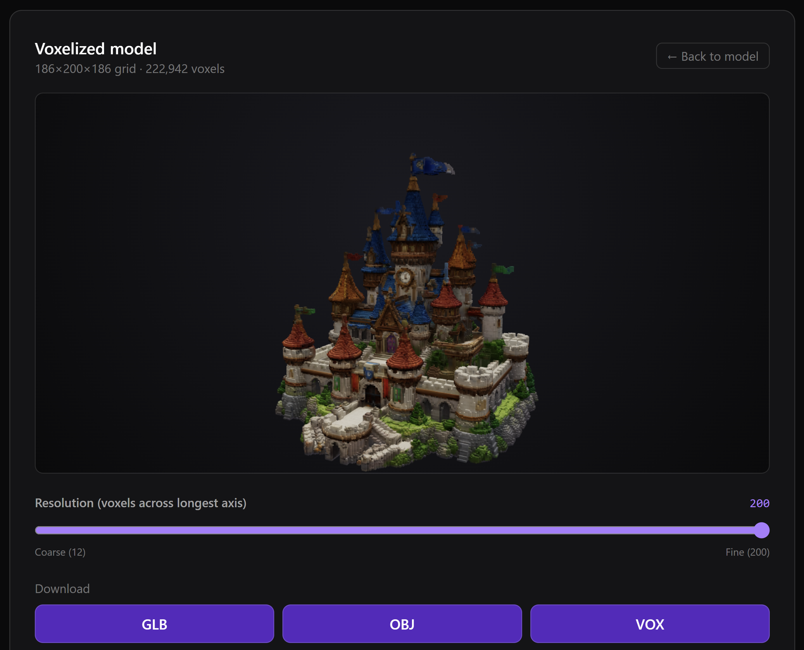

# Voxelizer

Type a few words, get a voxel model. This little app runs a full pipeline in the browser: text becomes an image, the image becomes a 3D mesh, and the mesh becomes a grid of colored voxels you can spin around and export.

<!-- HERO IMAGE: drop a screenshot here (a shot of the final voxel step looks great).
     Save it as assets/hero.png and it will show up below. -->
<p align="center">
  
</p>

## What it does

Three steps, one screen:

1. **Prompt to image.** Describe an object and a picture is generated for it.
2. **Image to 3D.** That image is turned into a textured 3D model you can orbit and inspect.
3. **3D to voxels.** The model is voxelized right in your browser. Drag the resolution slider to go from chunky to fine, then download the result.

Every step has a proper 3D viewer (drag to orbit, scroll to zoom, right-drag to pan).

## Exports

The voxel model can be saved in three formats, all keeping the colors sampled from the model's texture:

- **GLB** - a single merged, vertex-colored mesh. Drops straight into Blender, three.js, game engines, or any glTF viewer.
- **OBJ** - cubes with per-vertex colors, widely readable by mesh tools.
- **VOX** - native [MagicaVoxel](https://ephtracy.github.io/) format, with the palette quantized to fit the spec.

## Quick start

You need a fal API key. Grab one from the [fal dashboard](https://fal.ai/dashboard/keys), then:

```bash
# 1. add your key
echo "FAL_KEY=your-key-here" > .env.local

# 2. install and run
npm install
npm run dev
```

Open http://localhost:3000 and start typing.

> Tip: single, centered objects on plain backgrounds make the cleanest 3D models, so prompts like "a cute robot toy, studio lighting, white background" work better than busy scenes.

## How it works

The generation steps run as queued jobs and are polled until they finish, so longer reconstructions do not time out:

- Image generation uses **Nano Banana 2**.
- 3D reconstruction uses **Hunyuan 3D 3.1 Pro**, which returns a GLB plus an OBJ and a separate texture PNG.

The voxelizer itself is plain TypeScript running client-side. It walks every triangle of the OBJ, super-samples each one densely enough to cover the voxel grid, and averages the texture color per cell. The result is rendered as an instanced mesh of cubes, so even fine grids stay smooth to orbit. The OBJ and texture are pulled through a tiny same-origin proxy so the texture canvas stays readable for color sampling.

## Tech stack

- Next.js (App Router) and React
- three.js for the viewers and exporters
- Tailwind CSS for styling
- [fal](https://fal.ai) for the image and 3D models

## Notes

The voxelization, viewers, and all three exporters run entirely in the browser. The only server-side pieces are thin API routes that talk to fal and the media proxy, so your fal key never reaches the client.
